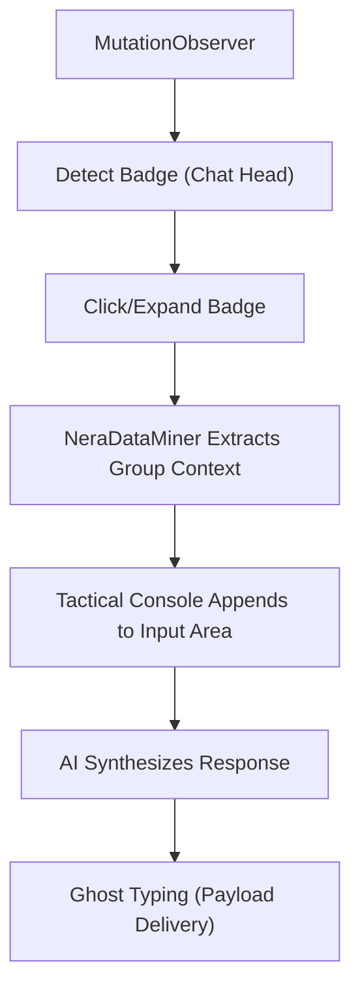

# PLAN: BADGE RECOGNITION AND CONTEXT SYNC

## SQUAD & SWARM
- **Architect:** Hawl (Lead Design)
- **Developer:** Hawl (Implementation)
- **Strategy:** `Sequential` - Phân tích DOM -> Bắt Event -> Truy xuất Context -> Tích hợp UI.

## RESEARCH & REASONING
- **Status:** [Research Completed]
- **Notes:** Group Chat SPA (như Messenger/Zalo) load nội dung qua lazy loading và Virtual DOM. Cần chiến lược MutationObserver linh hoạt hơn để bám sát Badge và ô input.

## DESCRIPTION
Bản kế hoạch này triển khai tính năng Infiltration cho các Group Chat thông qua bong bóng chat (Pinned Badge). Khi người dùng ghim một đoạn chat, hệ thống Nera sẽ gắn thêm nút Tactical UI vào gần Badge hoặc bên trong giao diện khi Badge được mở rộng. Từ đó, Nera quét ngữ cảnh nhóm và dùng AI phản hồi.

## GOAL
- Nera nhận diện thành công Pinned Chat Badge trên màn hình.
- Nera đọc được tên Group, các thành viên và 10 tin nhắn gần nhất.
- Giao diện Tactical UI của Nera đính kèm chính xác mà không bị tràn khung (overflow issues).
- Thêm nút chuyển đổi (Toggle) "Auto Reply Message Mode" trên thanh Sidebar (Nera Tactical Command).
- Khi bật Auto Reply, hệ thống tự động lắng nghe tin nhắn mới từ Badge và tự động Ghost Typing phản hồi.

## ARCHITECTURAL CONTEXT
Tích hợp vào module `Infiltrator.js` và mở rộng `NeraDataMiner`. Tính năng mới này sẽ bổ sung luồng `MODE = GROUP_CHAT_BADGE`, phân tách rõ ràng với `POST` và `COMMENT` thông thường.

*Hình 1: Luồng xử lý tích hợp Pinned Chat Badge*

## BOUNDARY & ENCAPSULATION
- **Public API (Exports):**
  - `Infiltrator.executeBadgeFlow()`: Luồng xử lý chính cho Badge.
- **Hidden Internals:**
  - `NeraDataMiner._extractGroupChat`: Ẩn đi để tránh conflict với feed extraction.
- **Optimization Targets:**
  - `CPU & Memory`: Giới hạn tốc độ quét của Observer (throttle) để không làm lag app chat vì DOM của chúng cập nhật liên tục.

## AEVUM CONTRACT
- **Inbound Context:** Nền tảng mục tiêu: Facebook / Messenger Web. Tính năng ghim chat hiển thị dưới dạng bong bóng.
- **Outbound Handshake:** AI có thể auto-reply trực tiếp vào khung chat ghim.

| Component | Responsibility | Target | Status |
| :--- | :--- | :--- | :--- |
| **BadgeObserver** | Theo dõi DOM tìm các element giống bong bóng chat | Tối ưu CPU, ko gây lag | PLANNED |
| **GroupDataMiner** | Trích xuất tin nhắn và người gửi trong cửa sổ chat | Độ chuẩn xác > 90% | PLANNED |
| **TacticalInjector** | Gắn giao diện Nera mà không phá vỡ UI gốc | Responsive, Z-index an toàn | PLANNED |
| **Sidepanel UI** | Thêm Toggle Button bật/tắt chế độ Auto Reply | Đồng bộ trạng thái với Background | PLANNED |

## IMPLEMENTATION STEPS

### Phase 1: Badge Detection
- [ ] [CODE] Mở rộng `Infiltrator.js` thêm selector: `div[role="button"][aria-label*="Mở đoạn chat với"]`.
- [ ] [TEST] Xác thực Nera có log ra khi một Badge chat mới xuất hiện và gắn Nera control (nút Edit) bên cạnh nó.

### Phase 2: Context Extraction & Data Miner
- [ ] [CODE] Thêm logic `_extractGroupChat` vào `NeraDataMiner.js`.
- [ ] [CODE] Thu thập lịch sử tin nhắn và định dạng prompt cho AI.
- [ ] [TEST] Log ra console cấu trúc tin nhắn để kiểm tra trước khi gửi API.

### Phase 3: Tactical UI & Ghost Typing
- [ ] [CODE] Tìm ô nhập liệu của cửa sổ chat khi Badge được mở.
- [ ] [CODE] Neo (anchor) Tactical Console vào cạnh ô nhập liệu đó.
- [ ] [CODE] Thử nghiệm Ghost Typing để đưa text vào ô input thành công.

### Phase 4: Auto Reply Automation (Sidebar Integration)
- [ ] [CODE] Chỉnh sửa `sidepanel.html` và `sidepanel.js` thêm nút "Auto Reply Mode".
- [ ] [CODE] Đồng bộ trạng thái Auto Reply vào `chrome.storage`.
- [ ] [CODE] Cập nhật logic `Infiltrator.js` để tự động kích hoạt payload nếu `autoReply = true`.

## KNOWLEDGE HARVEST
- **New Pattern:** [Pending]
- **Lesson Learned:** [Pending implementation completion]

---
*Generated by Aevum Architect System - 2026*

<!-- aevum_github_branch: feat/badge-recognition-and-context-sync-plan -->
<!-- aevum_base_branch: main -->
<!-- aevum_status: synced -->