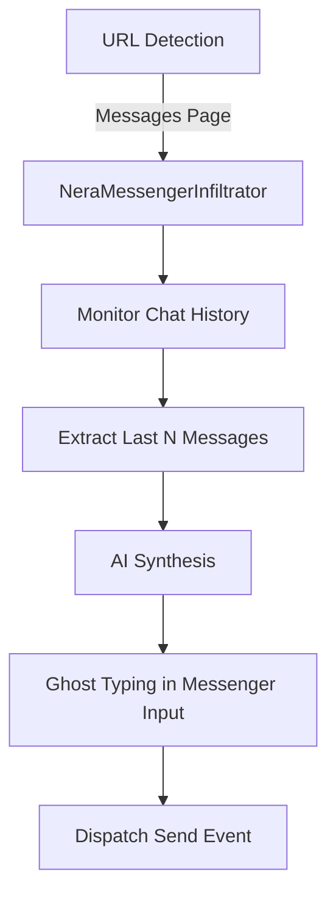

# Technical Research Paper: Messenger Auto Reply Implementation

**Date:** 2026-05-13
**Author:** Hawl (VOD-HAC-9X0F2E)
**Mission ID:** MSR-REPLY-001
**Tags:** [research, messenger, automation]
**Status:** completed

## Abstract
Nghiên cứu này xác định phương án kỹ thuật để triển khai tính năng Auto Reply trên giao diện Messenger (`facebook.com/messages`). Mục tiêu là xây dựng một hệ thống tách biệt hoàn toàn với Auto Comment, sử dụng các module hiện có của Nera nhưng với bộ selector và logic trích xuất context chuyên biệt cho tin nhắn hội thoại.

## Introduction
Hiện tại, Nera đang tập trung vào việc tương tác trên News Feed (Auto Comment). Tuy nhiên, nhu cầu thâm nhập sâu vào các cuộc hội thoại trực tiếp yêu cầu một kiến trúc mới có khả năng hiểu được luồng hội thoại (conversation flow) thay vì chỉ phân tích một bài đăng đơn lẻ.

## Methodology
Nghiên cứu sử dụng quy trình Aevum Iterative Discovery (AID):
- **Phase 1: Discovery**: Phân tích DOM của Messenger Desktop.
- **Phase 2: Analysis**: So sánh cấu trúc dữ liệu của Message Bubbles so với Post Content.
- **Phase 3: Synthesis**: Đề xuất module `NeraMessengerInfiltrator`.

## Results and Evaluation

### Key Insights Summary
| ID | Source | Key Finding | Confidence |
|---|---|---|---|
| INS-1 | DOM Analysis | Messenger E2EE sử dụng cấu trúc DOM bảo mật hơn, nhưng vẫn dựa trên `[role="main"]` cho hội thoại và `[role="textbox"]` cho nhập liệu. | High |
| INS-2 | Context | Cần trích xuất dữ liệu từ các node tin nhắn cuối cùng trong `[role="presentation"]` hoặc `[role="row"]`. | High |
| INS-3 | Automation | Tín hiệu "Enter" hoặc Click vào nút Send cần được dispatch chính xác sau Ghost Typing. | High |

### Detailed Analysis
1. **Targeting**:
   - URL: `https://*.facebook.com/messages/e2ee/t/*`
   - Input Selector: `div[role="textbox"][aria-label*="Tin nhắn"]` hoặc các class động của E2EE.
   - Tránh việc inject vào các thành phần phụ, chỉ tập trung vào khung chat chính.

2. **Data Extraction (DataMiner)**:
   - Cần một bộ lọc để bỏ qua các tin nhắn hệ thống (ví dụ: "Bạn đã xóa một tin nhắn").
   - Cần nhận diện được tin nhắn của đối phương (Left side) và tin nhắn của mình (Right side) để AI biết mình đang trả lời ai.

## Discussion
Việc tách biệt tính năng này ra khỏi Auto Comment là cần thiết vì:
- Logic trích xuất context khác nhau (Hội thoại vs Bài đăng).
- Trải nghiệm người dùng (UX) khác nhau (Input box Messenger thường nhỏ hẹp hơn).
- Tránh việc Auto Comment can thiệp nhầm vào các cửa sổ chat.

## Conclusion and Future Work
Phương án triển khai thông qua một Module Agent riêng biệt (`MessengerInfiltrator`) là tối ưu nhất. Hướng phát triển tương lai có thể bao gồm "Scheduled Replies" (Hẹn giờ trả lời) và "Smart Triggers" (Chỉ trả lời khi có từ khóa cụ thể).

---
Document generated by Aevum Deep Research Engine - Technical Paper Standard v2.1
